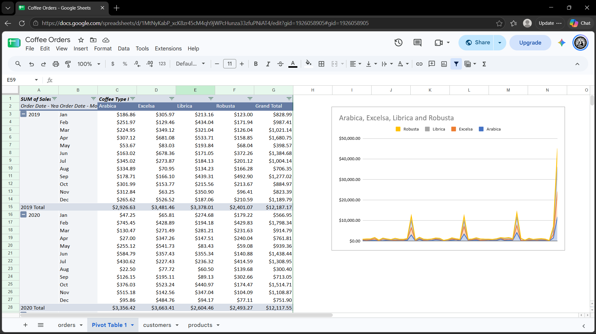

# Coffee Orders Sales Dashboard

## 📊 Project Overview
An interactive sales and orders analytics dashboard built using Google Sheets. This project evaluates multi-year transactional data for various coffee product lines to track revenue generation, product performance, and temporal sales trends.

🔗 **[View Live Google Sheet Dashboard](https://docs.google.com/spreadsheets/d/1MtNyKabP_xcK8zr45cM4qh9jWPcHunza33zfuPNiAT4/edit?usp=sharing)**

## 🛠️ Tools & Techniques
* **Google Sheets**
* **Pivot Tables**
* **Calculated Fields & Formulas**
* **Time-Series Charts & Data Visualization**

## 📈 Key Insights & Dashboard Features
* **Product Line Performance:** Comprehensive sales tracking across major coffee types including **Arabica, Excelsa, Librica, and Robusta**.
* **Temporal Analysis:** Monthly and yearly sales trend evaluations identifying peak demand cycles and seasonal fluctuations.
* **Revenue Breakdown:** Dynamic aggregation of total sales structured by order date and product categories.

## 📷 Dashboard Preview

